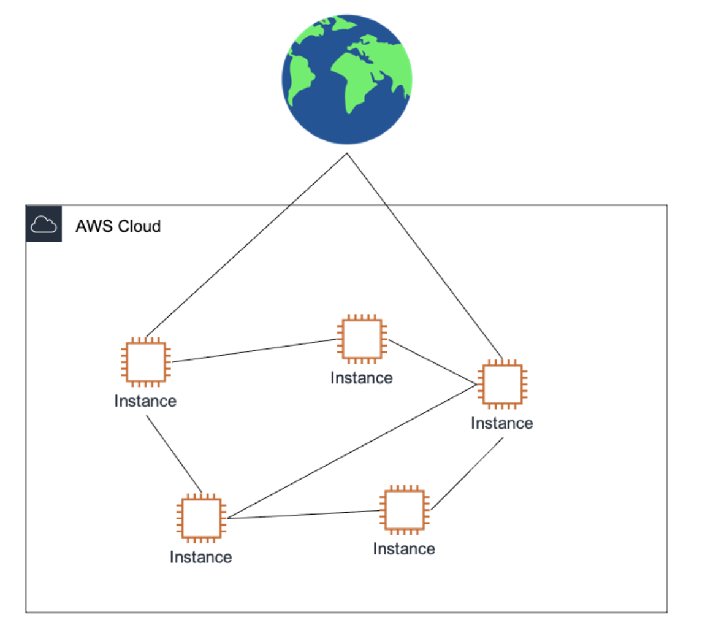

## 2주차 키워드 워크북

### 1. AWS
#### 📌 AWS(Amazon Web Service)란?

: 아마존이 제공하는 cloud computing(클라우드 컴퓨팅) platform!

+ **클라우드 컴퓨팅이란?**
  
    :인터넷을 통해 서버,데이터베이스, 네트워킹과 같은 다양한 컴퓨터 자원을 제공하고, 사용자가 이러한 자원을 유연하게 사용할 수 있게끔해주는 기술
    
+  클라우드 컴퓨팅 서비스의 3가지 종류
    
      1. IaaS - 서버, 저장 공간 등의 인프라를 가상화된 환경에서 쉽게 할당받아 사용하는 서비스
      2. PaaS - **IaaS** + 운영체제 , 미들웨어 , 애플리케이션 실행환경 등을 제공하는 서비스
      3. SaaS - **IaaS** + **PaaS** + 데이터, 어플리케이션을 제공하는 서비스
        
   
        

+ AWS 사용시 이점
    
    아마존의 데이터 센터를 이용해 필요한 만큼의 컴퓨팅 파워나 저장공간을 빌려 사용가능
    → 물리적인 서버 구매 불필요

---
### 2. 리전과 가용영역
#### 📌 리전이란?
 : 지리적 위치를 기반으로한 AWS의 데이터 센터 무리

`[특징]`

  - 각 리전은 독립적으로 운영됨 → 장애 발생시 서로에게 영향 X
      ex) 미국 동부, 유럽, 아시아…
    

#### 📌 가용영역이란?
: 1개 이상의 데이터 센터를 묶은 논리적인 데이터 센터

`[특징]`
    - 하나의 리전에는 여러개의 가용영역이 존재
    - 각 가용영역은 독립적으로 운영됨 → 장애 발생시 서로에게 영향 X

  

---

### 3. 서브네팅
#### 📌 서브네팅(Subnetting)이란?

: 하나의 큰 네트워크를 ⇒ 여러개의 네트워크로 나누는 과정

 + 쉽게 말해, 서브넷 마스크의 bit 수를 증가시키는 것!
     → 할당 가능한 네트워크수는 2배 증가, 호스트수는 1/2배 감소

    ex) 한 네트워크의 IP주고 범위가 192.168.1.0/24일때,
        → 서브넷 마스크를 /26으로 조정하면, 26bit까지 네트워크 주소이다.
        → 더 많은 수의 네트워크로 쪼갤 수 있음

---
### 4. 라우팅
: 패킷을 출발지에서 목적지까지 라우터를 거치며 효율적인 경로를 결정하는 과정

+ 라우팅에서 라우터의 역할
    : 라우팅 테이블을 참조해 목적지까지 가는 최적의 경로를 결정한다.

---
### 5. VPC
#### 📌 VPC란?

: 사용자가 정의하는 AWS계정 사용자 전용 가상의 네트워크 공간
(즉, AWS용 개인 네트워크 망 데이터 센터)

`[특징]`

- 사용자는 자기가 원하는대로 IP주소 범위 선택, subnet생성, 라우팅 테이블 구성, 게이트웨이 구성 가능

---

`[VPC의 이점]`

- **VPC 출현 이전**
    
      
    
    → 여러 사용자의 인스턴스(가상 컴퓨터)들이 얽혀있어 복잡도가 높았음
    
- **VPC 출현 이후**
    
      
    
    → 인스턴스를 VPC로 묶어 네트워크를 구분하고, VPC별로 필요한 설정을 적용함

---
### 6. 사설 IP 주소
#### 📌 사설 IP주소란?

: 인터넷 상에 공개되지 않고, 특정 조직 내부에서만 사용되도록 예약된 IP주소*

  → 인터넷을 통해 라우팅되지 X, 여러 조직에서 중복 사용 가능 O

  ⇒ 그래서 “사설 IP주소는 IP주소가 부족한 문제를 해결한다” 라는 말이 있는 것!

+ ex) 휴대폰에서 인터넷 접속시 ,
    
    - 5G데이터로 접속하는 경우 - 나만의 공인 IP주소가 할당된다
    - 와이파이로 접속하는 경우 - 공유기가 나에게 할당해준 사설 IP주소가 할당된다

      

---
↔ **공인 IP주소**

: 인터넷 상에서 **유일**하며, 전 세계적으로 인터넷에 연결된 장치를 식별하기 위해 사용함

### 7. 포트포워딩
#### 📌 포트포워딩(port forwarding)이란?

네트워크 주소 변환(NAT) 기능을 활용하여, 

인터넷에서 특정 포트로 들어오는 트래픽을 → 내부 네트워크의 특정 장치로 직접 전송하는 네트워크 라우팅 기술

+ ex) 공유기에서 특정 포트로 연결해주는 경우

  
    
    

---
### 8. NAT 프로토콜
#### 📌 NAT( Network Address Translation) 프로토콜이란?

: 쉽게 설명하자면, 사설 IP 주소를 인터넷상의 공인 IP 주소로 변환하는 프로토콜

*하지만 사실 IP주소 뿐만아니라 PORT번호까지 변환해주는 프로토콜을 말한다!*

    

`NAT의 장점`
    
    +) 여러 네트워크 호스트들이 적은 공인 IP주소를 사용할 수 있음
    
    +) LAN내에 장비 추가하기 쉬움
    
`NAT의 단점`
    
    -) 통신할때마다 NAT table을 이용해 ip주소를 끊임없이 변경해야하는 번거로움

---
### 9. 포트번호

#### 📌 포트번호란?
    
: 동일한 컴퓨터 안에서 통신을 하고 있는 **애플리케이션을 식별할 때 사용하는  주소**
    
      

    
`포트번호 종류`
             
   | 웰 노운 port | 0~1023번 | 서버 application용으로 예약된 포트 |
   | --- | --- | --- |
   | 등록된 port  | 1024~49151번 | 자주 이용되는 서버 application을 식별하기 위한 포트 |
   | 동적 port | 49152~65536번 | 클라이언트 application용 임시 포트 |

