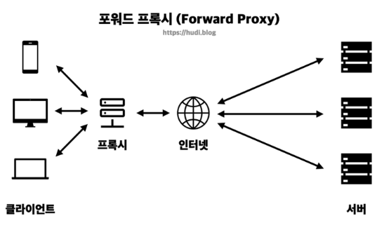

## 1)Web Sever


**📌 Web Server(웹 서버란?)**

  : 클라이언트의 요청을 받아 → 정적 콘텐츠(static)을 제공해주는 서버
  
  ex) NGINX, Apache HTTP server 

    
**✔️ 웹 서버의 기능**

    - 클라이언트의 요청에 따라 HTML 페이지나 이미지등의 정적 리소스를 제공한다
    - 주요 사용처) 단순히 저장되어 있는 콘텐츠를 빠르게 전달해야하는 경우

**✔️ NGINX 웹서버 코드**
/etc/nginx/sites-available 에서 cat default 실행시 파일 코드
```
server{
		...
		root /var/www;
		index welcome.html
		try_files $uri $uri/=404;
		...
		
		location /web{
			root /var/www;
			index hi.html
			try_files $uri $uri/=404;
		}
		...
	}
```


## 2) Web Application Server

**📌  WAS란?**

: 동적 컨텐츠를 생성하여 제공하는 웹 서버

ex) PHP, Node.js, Spring Boot 

**✔️ WAS의 기능**

    - 클라이언트의 요청에 따라 프로그램을 실행하여 그 결과를 동적을 생성해 제공한다.
    - 웹서버가 처리하기 어려운 동적인 요청을 처리하고, 웹서버에게 처리한 데이터를 전송해준다.


## 3) Reverse Proxy


**📌 Reverse Proxy(리버스 프록시)란?**

: 사용자와 서버 사이에서 중개자 역할을 하는 서버



**✔️ 리버스 프록시를 왜 사용하는가?**

    - 보안 강화 - 리버스 프록시는 웹 서버의 실제 IP주소를 숨겨줘서 → 외부의 직접적인 공격 막을 수 o (DDoS 등의 공격)
    - 부하 분산(로드 밸런싱) - 들어오는 요청을 여러 서버에 분산시킴
    - 캐싱 - 자주 요청되는 데이터를 리버스 프록시에 저장 → 필요할때마다 빠르게 제공

    
**↔  포워드 프록시**
    
    : 클라이언트들이 인터넷에 접근할때, 사용자들을 대표하여 접속한다

    
    

***즉, 포워드 프록시는 클라이언트 관점에서 인터넷 접속을 관리 및 제어하는데 초점을 두고 & 리버스 프록시는 서버의 관점에서 보안을 강화하는데 초점을 둔다!***

