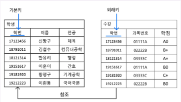
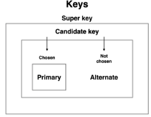
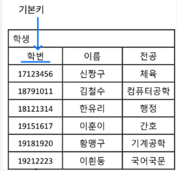

## 1) 외래키
    
📌 ***외래키(foreign key)란?***
    
: 외래키는 두 테이블을 연결하는 키!
   
→ 다른 테이블의 기본 키를 참조한다

  
- 외래키의 주요 특징들
  - 여러 테이블의 관계를 표현함
  - 참조하는 기본 키값이 변경되면, 해당 기본키를 참조하는 외래키도 변경되어야함
  - NULL값 허용
  - 중복값 허용

## 2) 기본키
- 포함관계
 - **슈퍼키** (유일성O,최소성X)  ⊃   **후보키** (유일성O,최소성O)  ⊃  **기본키**
   
        

📌 ***기본키(=주키=primary key)란?***

: 후보키 중에서 선정된 키!

  

- 기본키의 조건들
  - 해당 record/튜플을 식별할때 기준이되는 키여야함
  - NULL값을 가질 수 없음
  - 하나의 테이블에는 pk가 1개만 존재함
  - 유일성, 최소성

## 3) ER다이어그램
📌 **ERD란?**
    
: entity relation diagram으로 , 데이터 베이스의 구조를 한눈에 보기 쉽게 그려놓은 다이어그램

- ERD의 구성요소
        
        1) 개체(Entity)
           : DB에 저장하려는 객체나 개념
            ex) User,Book

        2) 관계(Relationship)
           : 개체 간의 연결
            ex) 1:1, 1:N, N:M
        
        3) 속성(Attribute)
           : 개체의 특징 및 세부 정보 ( 개체의 열에 해당 ) 
            ex) User의 속성 - name, phoneNum, gender…
        
- ERD 표기법
  
    1) peter chen 표기법
       
      
    
    2) 정보 공학 표기법
       
      

## 4) 복합키

📌 **복합 키란?**

: 데이터 베이스에서 행(튜플)을 고유하게 식별하기위해, 두개의 열(속성)을 결합하여 사용하는 키

→ 여러 열의 조합은 테이블내에서 고유한 값을 가져야함

  

- 슈퍼키와의 차이점
    - 슈퍼키) 고유성을 가진 여러 열의 조합 / 고유성을 가진 여러열
    - 복합키) 여러열의 조합이 고유성을 가지기만하면됨
 
## 5) 연관관계
- 연관관계 종류
  
  
     
## 6) 정규화

📌 **정규화란?**

: 데이터 베이스의 설계를 개선하여 데이터 중복을 최소하여 더욱더 바람직한 스키마를 만드는 과정

  

## 7) 반정규화

📌 **반정규화란?**

: 데이터 베이스의 성능을 향상시키기 위해 일부러 데이터베이스 설계를 단순화하고 중복을 증가시키는 과정

